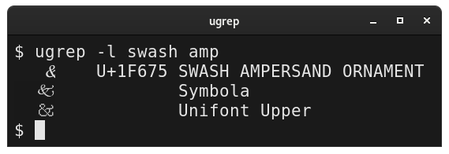
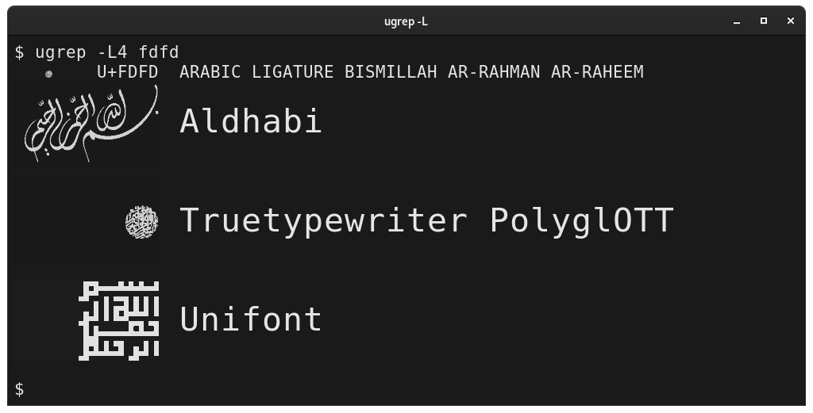
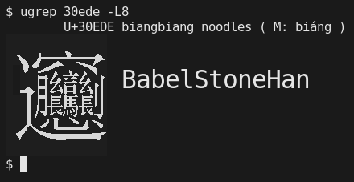

<a href="https://raw.githubusercontent.com/hackerb9/ugrep/master/README.md.d/screenshot.png">

</a>

# ☙ ugrep ❧

_Find unicode characters based on their names_

ugrep is essentially [grep](https://www.gnu.org/software/grep/) for
the Unicode table. It prints out the resulting unicode characters
literally, so you can easily cut-and-paste. Ugrep is useful for
looking up Emojis 😤, finding obscure symbols ⚸⅗ℏ℞☧☭, or beautiful
glyphs to decorate your text. 🙶❡✯🟔❢🙷

You can also use it for the reverse operation to lookup a single
character (or a string of them) you've pasted into the terminal.

As a bonus, it can list which fonts are installed that contain a
particular unicode character and — through the magic of sixels — will
show a rendering in each font.

## Installation

It's just a Python 3 shell script. Download it to `/usr/local/bin` or `~/bin`
and make it executable.

    cd /usr/local/bin
    wget https://github.com/hackerb9/ugrep/raw/master/ugrep
    chmod +x ugrep

## Usage

* Search by name: **ugrep** [**-w**] _regex_

	Look up a character name where _regex_ is a regular
	expression. If you don't know [regular
	expressions](https://docs.python.org/3/howto/regex.html),
	don't worry. Just use plain strings and you'll rarely be
	wrong.

	    ugrep runic

	If you find ugrep returning too many hits because the phrase you used
	is found in other terms, e.g., _thema_ found in _mathematical_, use
	the **-w** option to limit the search to complete words.

* Search by number: **ugrep** _codepoint_**[..**_codepoint_**[..**_increment_**]]**

	Look up a character (or a range of them) using Unicode code points in
	hexadecimal. For example,

	    ugrep 03c0
	    ugrep 23b0..f
		ugrep 0..10ffff..1000

* Search by character: **ugrep** [**-c**] _character string_

	Look up each character in a string. Note that if the string is a
	single character, e.g., `ugrep X`, then **-c** is implied and need not
	be specified.

	    ugrep -c "(ﾟ∀ﾟ)"

* List fonts for a character: **ugrep** [**-l**] _character_

	After showing the usual character information, list installed
    fonts that contain that character and show an example in each:

	    ugrep -l mho

	☝ *When `ssh`ed to another machine, `ugrep` shows the fonts
    installed on the remote machine.*

* List fonts, scaled larger: **ugrep** [**-L** _scale_] _character_
  
	Same as `-l`, but scale up the example rendering in each font to
    be easier to read:

	    ugrep -L2 -w om

    Useful scale values range from 2 to 8. 

### Examples:

Note: output from all examples has been excerpted. (You'd be amazed
how many heart emojis Unicode has. 😜)

* Plain text search is simple:

	    $ ugrep heart
	    ☙	U+2619	REVERSED ROTATED FLORAL HEART BULLET
	    ❣	U+2763	HEAVY HEART EXCLAMATION MARK ORNAMENT
	    ❤	U+2764	HEAVY BLACK HEART
	    ⋮	[ ... truncated for brevity ... ]
	    💞	U+1F49E REVOLVING HEARTS
	    💟	U+1F49F HEART DECORATION
	    😍	U+1F60D SMILING FACE WITH HEART-SHAPED EYES
	    😻	U+1F63B	SMILING CAT FACE WITH HEART-SHAPED EYES

* Paste in a single character to lookup its codepoint:

	    $ ugrep ☺
	    ☺       U+263A  WHITE SMILING FACE

* Arguments on the command line have an implicit wildcard between them:

	    $ ugrep right.*gle
	    $ ugrep right gle       # Equivalent
	    »	U+00BB	RIGHT-POINTING DOUBLE ANGLE QUOTATION MARK
	    ’	U+2019	RIGHT SINGLE QUOTATION MARK
	    ∟	U+221F	RIGHT ANGLE
	    ⊿	U+22BF	RIGHT TRIANGLE

* You can use regular expressions for fancier searches: 

	    $ ugrep -w '(wo|hu)?m(a|e)ns?'
	    ᛗ	U+16D7	RUNIC LETTER MANNAZ MAN M
	    ⛀	U+26C0	WHITE DRAUGHTS MAN
	    ⛂	U+26C2	BLACK DRAUGHTS MAN
	    ⼈	U+2F08	KANGXI RADICAL MAN
	    ⼥	U+2F25	KANGXI RADICAL WOMAN
	    𝌂	U+1D302	DIGRAM FOR HUMAN EARTH
	    𝌄	U+1D304	DIGRAM FOR EARTHLY HUMAN
	    🕴	U+1F574	MAN IN BUSINESS SUIT LEVITATING
	    🕺	U+1F57A	MAN DANCING
	    🚹	U+1F6B9	MENS SYMBOL
	    🚺	U+1F6BA	WOMENS SYMBOL
	    🤰	U+1F930	PREGNANT WOMAN
	    🤵	U+1F935	MAN IN TUXEDO
	    
	    $ ugrep ^x		    #  Regex anchors ^ and $ work
	    ⊻	U+22BB	XOR
	    ⌧	U+2327	X IN A RECTANGLE BOX (clear key)

* Use the `-w` flag to search only for complete words:

	    $ ugrep -w R	    # The letter R used as a word
	    $ ugrep "\bR\b"	    # (regex equivalent)
	    R	U+0052	LATIN CAPITAL LETTER R
	    Ŗ	U+0156	LATIN CAPITAL LETTER R WITH CEDILLA
	    ℛ	U+211B	SCRIPT CAPITAL R (Script r)
	    ℜ	U+211C	BLACK-LETTER CAPITAL R (Black-letter r)
	    ℝ	U+211D	DOUBLE-STRUCK CAPITAL R (Double-struck r)

* Use -c to display info for each character in a string.

        $ ugrep -c "ᕕ( ᐛ )ᕗ"
        ᕕ   U+1555  CANADIAN SYLLABICS FI
        (   U+0028  LEFT PARENTHESIS (opening parenthesis)
            U+0020  SPACE
        ᐛ   U+141B  CANADIAN SYLLABICS NASKAPI WAA
            U+0020  SPACE
        )   U+0029  RIGHT PARENTHESIS (closing parenthesis)
        ᕗ   U+1557  CANADIAN SYLLABICS FO

* Aliases (alternate names) are also searched:

	    $ ugrep backslash
	    \	U+005C	REVERSE SOLIDUS (backslash)

* Use **..** to browse through a range of Unicode characters:

	    $ ugrep 26b3..b
	    ⚳	U+26B3	CERES
	    ⚴	U+26B4	PALLAS
	    ⚵	U+26B5	JUNO
	    ⚶	U+26B6	VESTA
	    ⚷	U+26B7	CHIRON
	    ⚸	U+26B8	BLACK MOON LILITH
	    ⚹	U+26B9	SEXTILE
	    ⚺	U+26BA	SEMISEXTILE
	    ⚻	U+26BB	QUINCUNX

	    $ ugrep 1f470..ff  |  less
	    👰	U+1F470	BRIDE WITH VEIL
	    👱	U+1F471	PERSON WITH BLOND HAIR
	    👲	U+1F472	MAN WITH GUA PI MAO
	    👳	U+1F473	MAN WITH TURBAN
	    👴	U+1F474	OLDER MAN
	    👵	U+1F475	OLDER WOMAN
	    👶	U+1F476	BABY
	    👷	U+1F477	CONSTRUCTION WORKER
	    👸	U+1F478	PRINCESS
	    👹	U+1F479	JAPANESE OGRE
	    👺	U+1F47A	JAPANESE GOBLIN
	    👻	U+1F47B	GHOST
	    👼	U+1F47C	BABY ANGEL
	    👽	U+1F47D	EXTRATERRESTRIAL ALIEN
	    ⋮	[ ... truncated for brevity ... ]
	    📼	U+1F4FC	VIDEOCASSETTE
	    📽	U+1F4FD	FILM PROJECTOR
	    📾	U+1F4FE	PORTABLE STEREO
	    📿	U+1F4FF	PRAYER BEADS
    Sometimes it's useful (or fun) to page through the Unicode table
    and see what characters are defined in a region. 
	Try `ugrep 2700..ff` .

  * Ranges can have an optional increment:

	```
	$ ugrep 0..ffff..1000
	   �    U+0000  <control> (null)
	   က    U+1000  MYANMAR LETTER KA
	  [ ]   U+2000  EN QUAD
	  [　]  U+3000  IDEOGRAPHIC SPACE
	   䀀   U+4000  cups; small cups ( M: fàn, C: fan3 fan4 fan6 )
	   倀   U+5000  bewildered; rash, wildly ( M: chāng, C: caang1 caang4 coeng1 zaang1, J: KURUU TAORERU, K: CHANG, V: trành )
	   怀   U+6000  bosom, breast; carry in bosom ( M: huái, C: waai4 )
	   瀀   U+7000  [CJK Unified Ideographs] ( M: yōu, J: ATSUI )
	   耀   U+8000  shine, sparkle, dazzle; glory ( M: yào, C: jiu6, J: KAGAYAKU, K: YO )
	   退   U+9000  step back, retreat, withdraw ( M: tuì, C: teoi3, J: SHIRIZOKU SHIRIZOKERU, K: THOY, V: thoái )
	   ꀀ   U+A000  YI SYLLABLE IT
	   뀀   U+B000  Block: [Hangul Syllables]
	   쀀   U+C000  Block: [Hangul Syllables]
	   퀀   U+D000  Block: [Hangul Syllables]
	   �    U+E000  <Private Use, First>
	       U+F000  Block: [Private Use Area]
	```

  * Tip: pipe long output to `less` and search for a code point by
    pressing `/U\+A60F`.

* Use -l to list which installed fonts contain a certain glyph:
  <a href="https://raw.githubusercontent.com/hackerb9/ugrep/master/README.md.d/list-fonts.png">
  
  </a>

      ugrep -l swash amp

  * Requires FontConfig. (Most GNU/Linux boxes should already be set).
  
  * The requested character may also be displayed in each of the
    listed typefaces, but only if your terminal supports sixel
    graphics (e.g., `xterm -ti vt340`) and you have ImageMagick
    installed.

* Use -L to scale up the font examples when listing fonts
  
  <a href="https://raw.githubusercontent.com/hackerb9/ugrep/master/README.md.d/list-fonts-scale.png">
  
  </a>
  
  ```
  ugrep -L4 fdfd
  ```

  * Note: Increasing the glyph size also increased the text size. Not
    all terminals are capable of "double height" text. If yours shows
    two lines of the same text in the usual size, try using
    `--never-double-text`.

* View _all_ characters defined by Unicode:

	    $ ugrep .?  |  less
	    ⋮	[ ... over 30,000 glyphs elided for brevity ... ]

  * Want just Unicode glyphs without the description? Please use
    [fonttable](https://github.com/hackerb9/fonttable). It shows all
    defined Unicode characters by default.

* To see CJK (Chinese-Japanese-Korean) characters that Unicode defines
  indirectly via Unihan, you may specify the code point or paste in an
  example character to look up.

		$ ugrep 30ede
		   𰻞	U+30EDE	biangbiang noodles ( M: biáng )

        $ ugrep 耀
        耀	U+8000	shine, sparkle, dazzle; glory ( M: yào, C: jiu6, J: KAGAYAKU, K: YO )

  <a href="README.md.d/biangbiang.png">
  
  </a>

* Show all possible code points, defined in Unicode or not:

		$ ugrep 0..10FFFF | less
	    ⋮	[ ... over a million lines elided for brevity ... ]

  ☝ This is currently very slow due to the way `ugrep` is implemented.
  You likely want to use
  [fonttable -u](https://github.com/hackerb9/fonttable) instead. 
  
### Fun things to try:

To see some useful and lovely glyphs, try this:

    ugrep face 
    ugrep alchemical 
    ugrep ornament
    ugrep bullet
    ugrep '(vine|bud)'
    ugrep vai
    ugrep heavy
    ugrep drawing
    ugrep combining

## Prerequisite: UnicodeData.txt

Ugrep requires the Unicode data file
[UnicodeData.txt](https://unicode.org/Public/UNIDATA/UnicodeData.txt)
which can be installed on your system, in your home, or in the current
directory.

**Easiest**: On Ubuntu and Debian GNU/Linux, simply `apt install unicode-data`.

**Still easy**: Or, you can download it by hand from
[unicode.org](https://unicode.org/Public/UNIDATA/UnicodeData.txt)
and place it in `~/.local/share/unicode/UnicodeData.txt`

**Not hard**: Or, if you wish the file to be accessible to all users on
your machine, place it in `/usr/local/share/unicode/UnicodeData.txt`.

## Unihan CJK Support

If the file `Unihan_Readings.txt` exists, then ugrep will
automatically use it to show an English gloss describing a character
in the CJK (Chinese-Japanese-Korean) Ideographs region.

### CJK example

#### Example 1: Unicode code point

```
$ ugrep 8000
   耀   U+8000  shine, sparkle, dazzle; glory ( M: yào, C: jiu6, J: KAGAYAKU, K: YO )
```

The parenthesized text at the end shows the romanized pronunciation of
the character in **M**andarin (pinyin), **C**antonese (jyutping),
**J**apanese (Hepburn), and **K**orean (Yale).

#### Example 2: Using -c to see characters in a string

```
$ ugrep -c 「⿺辶⿳穴⿰月⿰⿲⿱幺長⿱言馬⿱幺長刂心」
   「   U+300C  LEFT CORNER BRACKET (opening corner bracket)
   ⿺   U+2FFA  IDEOGRAPHIC DESCRIPTION CHARACTER SURROUND FROM LOWER LEFT
   辶   U+8FB6  walk; walking; KangXi radical 162 ( M: chuò, J: SHINNYOU )
   ⿳   U+2FF3  IDEOGRAPHIC DESCRIPTION CHARACTER ABOVE TO MIDDLE AND BELOW
   穴   U+7A74  cave, den, hole; KangXi radical 116 ( M: xué, C: jyut6, J: ANA, K: HYEL, V: huyệt )
   ⿰   U+2FF0  IDEOGRAPHIC DESCRIPTION CHARACTER LEFT TO RIGHT
   月   U+6708  moon; month; KangXi radical 74 ( M: yuè, C: jyut6, J: TSUKI, K: WEL, V: nguyệt )
   ⿰   U+2FF0  IDEOGRAPHIC DESCRIPTION CHARACTER LEFT TO RIGHT
   ⿲   U+2FF2  IDEOGRAPHIC DESCRIPTION CHARACTER LEFT TO MIDDLE AND RIGHT
   ⿱   U+2FF1  IDEOGRAPHIC DESCRIPTION CHARACTER ABOVE TO BELOW
   幺   U+5E7A  one; tiny, small ( M: yāo, C: jiu1, J: CHIISAI, K: YO )
   長   U+9577  long; length; excel in; leader ( M: zhǎng, C: coeng4 zoeng2, J: NAGAI TAKERU OSA, K: CANG, V: trường )
   ⿱   U+2FF1  IDEOGRAPHIC DESCRIPTION CHARACTER ABOVE TO BELOW
   言   U+8A00  words, speech; speak, say ( M: yán, C: jin4, J: KOTO IU KOTOBA, K: EN UN, V: ngôn )
   馬   U+99AC  horse; surname; KangXi radical 187 ( M: mǎ, C: maa5, J: UMA, K: MA, V: mã )
   ⿱   U+2FF1  IDEOGRAPHIC DESCRIPTION CHARACTER ABOVE TO BELOW
   幺   U+5E7A  one; tiny, small ( M: yāo, C: jiu1, J: CHIISAI, K: YO )
   長   U+9577  long; length; excel in; leader ( M: zhǎng, C: coeng4 zoeng2, J: NAGAI TAKERU OSA, K: CANG, V: trường )
   刂   U+5202  knife; radical number 18 ( M: dāo, C: dou1, J: RITSUTOU, K: TO )
   心   U+5FC3  heart; mind, intelligence; soul ( M: xīn, C: sam1, J: KOKORO, K: SIM, V: tâm )
   」   U+300D  RIGHT CORNER BRACKET (closing corner bracket)
```

### Note 1: A "definition" is not a translation
Unihan calls the English gloss the character's "definition", but that
is meant in a very loose sense. CJK characters change meaning based
upon the context they are used in. For example, most Chinese words are
made of two characters, such as "蜂鸟", which means "hummingbird", but
ugrep would shows it as:

```
$ ugrep -c 蜂鳥
   蜂   U+8702  bee, wasp, hornet ( M: fēng, C: fung1, J: HACHI, K: PONG, V: ong )
   鳥   U+9CE5  bird; KangXi radical 196 ( M: niǎo, C: niu5, J: TORI, K: CO, V: điểu )
```

### Note 2: Not all characters have readings

Unihan refers to this supplemental information, both the English gloss
and the romanizations, as "readings". Readings are meant to be
helpful, but are not normative and are only available for some
characters.

|                    |  Count | Percent |
|--------------------|-------:|--------:|
| All CJK Characters | 93,858 |    100% |
| Have any reading   | 47,429 |     51% |
| Mandarin Pinyin    | 41,378 |     44% |
| Cantonese Jyutping | 23,112 |     25% |
| English definition | 21,076 |     23% |
| Japanese Hepburn   | 11,293 |     12% |
| Korean Yale        |  9,051 |     10% |
| Vietnamese         |  8,301 |      9% |

#### Example of CJK with no Mandarin

```
$ ugrep 2bac3
   𫫃   U+2BAC3 (Cant.) sarcastic interrogative ( C: e1 )
```
#### Example of CJK with no pronunciation

```
$ ugrep 20015
   𠀕   U+20015 Variant of U+4E99 亙
```

#### Example of CJK with no English definition

```
$ ugrep 20016
   𠀖   U+20016 [CJK Unified Ideographs Extension B] ( V: khạng )
```

#### Example of CJK with no readings whatsoever

```
$ ugrep 2abcd
   𪯍   U+2ABCD [CJK Unified Ideographs Extension C]
```
Note that ugrep currently prints just the name of the block the
character is in [within square brackets] if it has no better way to
identify the character. 


- - - - - - - - - - - - - - - - - - - - - - - - - - - - - - - - 

## Boring Implementation notes

This is a rewrite of b9's AWK ugrep into Python. While AWK makes more
sense for what this program does (comparing fields based on regexps),
a rewrite was necessary because GNU awk, while plenty powerful, uses
`\y` for word edges instead of the standard `\b`. Gawk does this for
backwards compatibility with historic AWK, but lacks a way to disable
it for new scripts.

Switching to Python did have the benefit of allowing more powerful
Perlesque regexes (not that anyone has requested that).

### Why not use unicodedata module?

I do not use Python's `unicodedata` module because it is woefully
insufficient. It allows one to search by character name only by
specifying it fully and exactly: `unicodedata.lookup("ROTATED HEAVY
BLACK HEART BULLET")`.

## Future Work

### Maybe use Unihan_Readings.txt for grepping

Currently if `Unihan_Readings.txt` is installed — which is the default if
the user has done `apt install unicode-data`) — and the user requests a
character that is not in UnicodeData.txt, then the Readings data is
used to show information about the character. However, Unihan_Readings
could be used in the future for searching for characters to show.

Example data from Unihan_Readings for U+9B44 (魄): 

	U+9B44	kCantonese	bok3 paak3 tok3
	U+9B44	kDefinition	vigor; body; dark part of moon
	U+9B44	kHangul	백:0N
	U+9B44	kHanyuPinlu	pò(11)
	U+9B44	kHanyuPinyin	74431.090:pò,bó,tuò
	U+9B44	kJapaneseKun	TAMASHII
	U+9B44	kJapaneseOn	HAKU BAKU
	U+9B44	kKorean	PAYK
	U+9B44	kMandarin	pò
	U+9B44	kTGHZ2013	287.140:pò
	U+9B44	kTang	*pæk
	U+9B44	kVietnamese	phách
	U+9B44	kXHC1983	0084.110:bó 0887.020:pò 1175.020:tuò

See [UAX #38: Unicode Han Database](https://www.unicode.org/reports/tr38/tr38-31.html).

Two levels of Unihan support:
1. Show kDefinition if block name is *CJK Ideographs*
2. Search Unihan_Readings when searching for a word. Possible example:
       $ ugrep mononoke
	   魅	U+9B45	MONONOKE BAKEMONO SUDAMA (kind of forest demon, elf)

Number 1 is finished and working, but number 2 may require a command
line switch or some other way of enabling/disabling it as searching
through the Readings file may be slow or cause other problems.

### Maybe use NamesList.txt

It looks like
[`NamesList.txt`](https://unicode.org/Public/UNIDATA/NamesList.txt)
might be useful to also parse as it allows multiple aliases for a
character. For example (from `grep -B1 [=%] NamesList.txt`):

    0023    NUMBER SIGN
            = pound sign, hash, crosshatch, octothorpe

    002E    FULL STOP
            = period, dot, decimal point
    --
    002F    SOLIDUS
            = slash, virgule

    1F70A   ALCHEMICAL SYMBOL FOR VINEGAR
            = crucible; acid; distill; atrament; vitriol; red
              sulfur; borax; wine; alkali salt; mercurius vivus,
              quick silver

I'm not sure how useful this will be (who is going to look up the
number sign by searching on "octothorpe"), but it'd be nice to be able
to at least show them as aliases.

Also, NamesList.txt has a fascinating "cross reference" feature:

    0021    EXCLAMATION MARK
            = factorial
            = bang
            x (inverted exclamation mark - 00A1)
            x (latin letter retroflex click - 01C3)
            x (double exclamation mark - 203C)
            x (interrobang - 203D)
            x (heavy exclamation mark ornament - 2762)

How would one find the interrobang (‽) without such a cross reference?

Note that the NamesList.txt file actually starts with a warning *not*
to parse it as it says it is generated mechanically from
UnicodeData.txt plus "manually created annotations". However, those
annotations are what is interesting about the file (the aliases and
cross references) and there appears to be no other official source of
that data.


## Bugs, Misfeatures, and Workarounds

* The usage message is getting long. 
  We've already split the examples section into its own page with `-x`, but it now needs to split again.

* Brace expansion is confusing because of needing to be quoted from
  the shell. It is supported for ranges (not sequences), but is not
  currently documented because usage is tricky and the functionality
  is not actually that helpful. For example, the following works:

      ugrep {0..F}{0,4,8,C}00

  but could be better written as:	

      ugrep 0..FFFF..400

* [Note: The following is not a problem for people who are willing to
  use vector fonts (truetype, opentype, postscript) that may be
  antialiased. Xterm uses fontconfig just fine.]

  <details>

  For bitmap fonts, Xterm (as of version 369) seems to be able to only
  use one font at a time, which means a single font must have all the
  glyphs you want shown. (Yes, you can have a second bitmap font for
  "wide" CJK, but that's still not enough.)

  The author (hackerb9) currently prefers using the Neep bitmap font
  like so in `~/.Xresources`:

      ! Neep looks nice, has good unicode coverage. Requires xfonts-jmk.
      xterm*vt100.font        :       *neep-medium-r-normal--20*10646*
      ! Neep lacks Asian characters
      xterm*vt100.wideFont    :       *fixed-medium-r-normal-ja-18*10646*

  Neep has two major downsides. 1. It is a bitmap font with only one
  size well implemented, so you can't zoom in or out. 2. It is limited
  to 65536 characters, which means it cannot show characters outside
  of Unicode's Basic Multilingual Plane, such as new emojis. Neep can
  be installed on Debian GNU/Linux systems with `apt install
  xfonts-jmk`.


* Mlterm appears to have the same single font limitation as Xterm.
  Also, it right aligns text that has even a single character in a
  right-to-left alphabet, such as Arabic, so the output from ugrep
  will look a little funny.

  </details>

* Gnome-terminal uses `font-config`, so it has very nice Unicode
  support and can easily zoom in with Ctrl-+⃣ and Ctrl--⃣. Older
  versions had a bug where combining characters were combined with the
  following character instead of the previous, but this is now fixed.

  It does not support sixel graphics, so the -l option cannot show
  examples of the character in different fonts.
