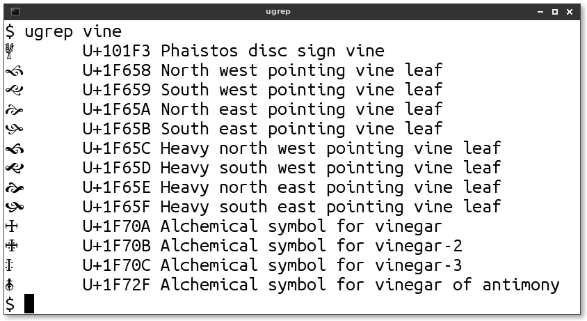

# ugrep
_Find unicode characters based on their names_

ugrep is essentially grep for the Unicode table. It prints out the
resulting unicode characters literally, so you can cut-and-paste
easily.

See also b9's `charname` for the reverse operation which can lookup a
character you've pasted into the terminal.

## Usage

    ugrep: find unicode characters based on their names
    Usage: 
	ugrep <regex>

	Where regex is a regular expression or a plain string. 

	For example:

	    $ ugrep heart
	    ☙	U+2619	REVERSED ROTATED FLORAL HEART BULLET
	    ❣	U+2763	HEAVY HEART EXCLAMATION MARK ORNAMENT
	    ❤	U+2764	HEAVY BLACK HEART
	    [ ... examples truncated for brevity ... ]
	    😻	U+1F63B	SMILING CAT FACE WITH HEART-SHAPED EYES

	    $ ugrep right.*gle
	    $ ugrep right gle       # Equivalent
	    »	U+00BB	RIGHT-POINTING DOUBLE ANGLE QUOTATION MARK
	    ’	U+2019	RIGHT SINGLE QUOTATION MARK
	    ∟	U+221F	RIGHT ANGLE
	    ⊿	U+22BF	RIGHT TRIANGLE

	    $ ugrep "\bR\b"         # The letter R used as a word
	    R       U+0052  Latin capital letter r
	    Ŗ       U+0156  Latin capital letter r with cedilla
	    ℛ       U+211B  Script capital r (Script r)
	    ℜ       U+211C  Black-letter capital r (Black-letter r)
	    ℝ       U+211D  Double-struck capital r (Double-struck r)

	    $ ugrep "^[aeiouy]+$"		# Entire name is only vowels
	    👁	U+1F441	EYE

	    $ ugrep .
	    [ This would show you every single Unicode character! ]

## Prerequisite: UnicodeData.txt

You must have a copy of
[UnicodeData.txt](https://unicode.org/Public/UNIDATA/UnicodeData.txt)
installed.

### Easiest

On Ubuntu and Debian GNU/Linux, simply `apt install unicode-data`.

### Still easy

Or, you can download it by hand from
[unicode.org](https://unicode.org/Public/UNIDATA/UnicodeData.txt)
and place it in `~/.local/share/unicode/UnicodeData.txt`

### Not hard

Or, if you wish the file to be accessible to all users on your machine,
place it in `/usr/local/share/unicode/UnicodeData.txt`. 

## Fun things to try:

Here are some examples one can try, to see some useful and lovely
glyphs.

    ugrep alchemical 
    ugrep ornament
    ugrep bullet
    ugrep '(vine|bud)'
    ugrep vai
    ugrep heavy
    ugrep drawing
    ugrep . | less

## Boring Implementation notes

This is a rewrite of b9's AWK ugrep into Python. While AWK makes more
sense for what this program does (comparing fields based on regexps),
a rewrite was necessary because GNU awk, while plenty powerful, uses
`\y` for word edges instead of the standard `\b`. Gawk does this for
backwards compatibility with historic AWK, but lacks a way to disable
it for new scripts.

Switching to Python did have the benefit of allowing more powerful
Perlesque regexes (not that anyone has requested that).

### Why not use unicodedata module?

I do not use Python's `unicodedata` module because it is woefully
insufficient. It allows one to search by character name only by
specifying it fully and exactly: `unicodedata.lookup("ROTATED HEAVY
BLACK HEART BULLET")`.

## Future Work

### Search comment field

The original AWK version of `ugrep` also searched through the comment
field, which meant, for example, that `ugrep backslash` would work
properly, even though Unicode calls that character "Reverse solidus".
This is a bug and I plan on fixing it.

### Maybe use NamesList.txt

It looks like
[`NamesList.txt`](https://unicode.org/Public/UNIDATA/NamesList.txt)
might be useful to also parse as it allows multiple aliases for a
character. For example (from `grep -B1 [=%] NamesList.txt`):

    0023    NUMBER SIGN
            = pound sign, hash, crosshatch, octothorpe

    002E    FULL STOP
	    = period, dot, decimal point
    --
    002F    SOLIDUS
	    = slash, virgule

    1F70A   ALCHEMICAL SYMBOL FOR VINEGAR
            = crucible; acid; distill; atrament; vitriol; red
              sulfur; borax; wine; alkali salt; mercurius vivus,
    	      quick silver

I'm not sure how useful this will be (who is going to look up the
number sign by searching on "octothorpe"), but it'd be nice to be able
to at least show them as aliases.

Also, NamesList.txt has a fascinating "cross reference" feature:

    0021    EXCLAMATION MARK
	    = factorial
	    = bang
	    x (inverted exclamation mark - 00A1)
	    x (latin letter retroflex click - 01C3)
	    x (double exclamation mark - 203C)
	    x (interrobang - 203D)
	    x (heavy exclamation mark ornament - 2762)

How would one find the interrobang (‽) without such a cross reference?

Note that the NamesList.txt file actually starts with a warning *not*
to parse it as it says it is generated mechanically from
UnicodeData.txt plus "manually created annotations". However, those
annotations are what is interesting about the file (the aliases and
cross references) and there appears to be no other official source of
that data.
